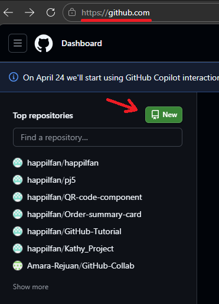
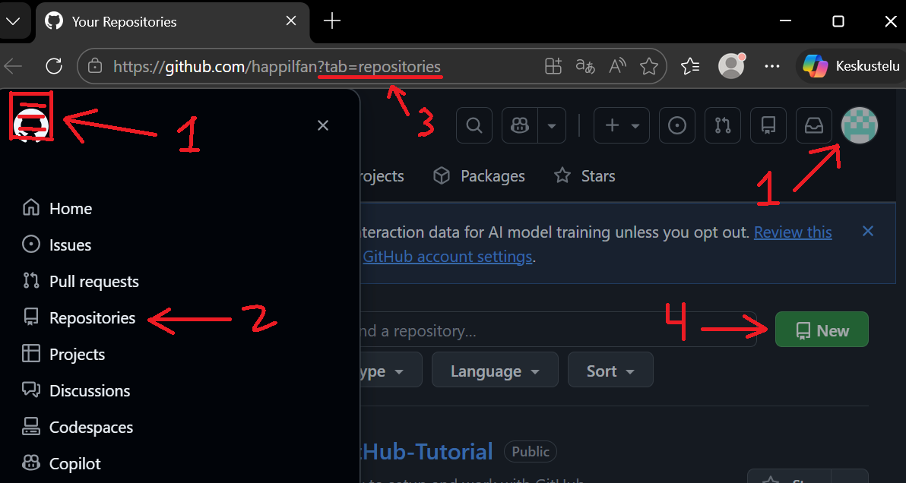
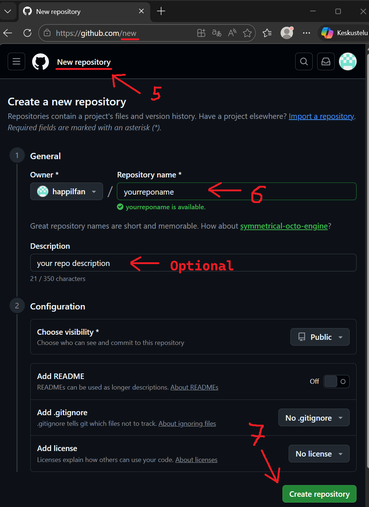
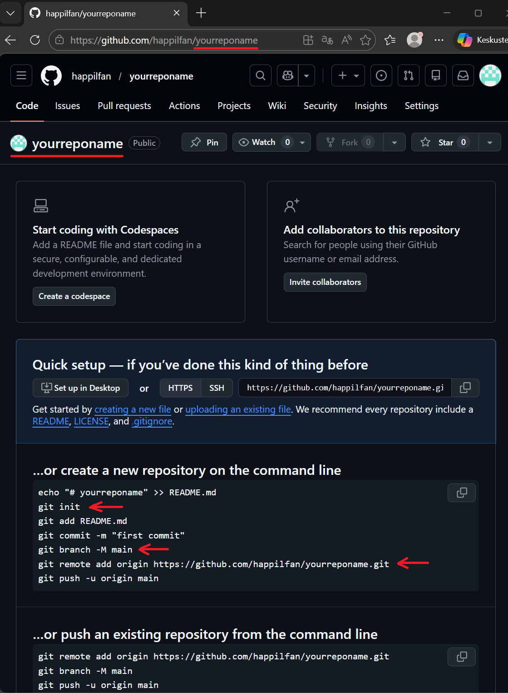

# GitHub Tutorial

## Table of Contents

- [0. Preparation](#0-preparation)
- [1. Basic Terminal Commands](#1-basic-terminal-commands)
- [2. Creating and Setup New Repository](#2-creating-and-setup-new-repository)
- [3. Work with Files](#3-work-with-files)

### 0. Preparation.
> (if still is not done yet)
1. Install [Visual Studio Code](https://code.visualstudio.com/)
2. Install [Git](https://git-scm.com/)
3. Register on [GitHub](https://github.com/)

### 1. Basic Terminal Commands.
> Examples: ```foldername``` is name of folder, ```filename.txt``` is name of file.
  - ```pwd``` (print working directory) - Checking current dirrectory
  - ```ls``` (list) - Checking folders & files in current dirrectory
  - ```cd foldername``` (change directory) - Go to folder
  - ```mkdir foldername``` (make directory) - Create a new folder in current dirrectory
  - ```touch filename.txt``` - Create a new file with any file format in current dirrectory
  - ```rm filename.txt``` (remove) - Delete a file in current dirrectory
    - ```rm -r foldername``` - Delete a folder (WITH ALL FILES INSIDE!) in current dirrectory
  - **```anycommand --help``` - <ins>(If you need help) Check documentation and help of this command**</ins>
  <br/>

*Bonus Terminal Commands.*

> Examples: ```text``` is text of file.
  - ```echo text > filename.txt``` - (re)Create a file with text
  - ```echo text >> filename.txt``` - Add text in new line of file
  - ```nano filename.txt``` - Edit file in Terminal (like in txt editor!) Use ctrl+O for save and ctrl+X for exit

### 2. Creating and Setup New Repository.
1. GitHub.
  - Go to GitHub and create New Repository (aka Repo)
    - You can click on the green button 'New' on the https://github.com/ page<br/>
       
    - You can click on Your Username Icon or Menu Button → Repositories, and click 'New' there<br/>
       
    - Give name and click 'Create repository'<br/>
       
2. Visual Studio Code (aka VSC).
  - Go to VSC: Open Git Bash Terminal and use this commands
    - ```git init``` - Creating a new Git Repository in your current folder on your PC
    - ```git remote add origin https://github.com/yourprofilename/yourreponame.git``` - Connecting your local Git Repository (Repo on your PC) to a remote Repository (Repo on GitHub)
    - ```git branch -M main``` - Rename your current branch to 'main' (it's important because GitHub use the name is 'main' and for don't get the not match conflict need to rename)
<details>
<summary>(After creating a new repo in GitHub you can see this commands there, and you can just copy and paste into VSC terminal)</summary>



</details>

> After this steps you will link your local repo on your PC and remote repo on GitHub, and will ready to work.

### 3. Work with Files.
1. Send/Update files from PC to GitHub.
  - ```git add filename.txt``` - Add files to Stage changes (you tell Git which files you want to include in the next commit)
    - If you want to add all files you can use ```git add .```
  - ```git commit -m "yourmessage"``` - Save (Commit) your Staged changes with a short description
  - ```git push -u origin main``` - Upload your Commits to remote repo (GitHub)
    - Next time you can use only ```git push``` because Git already know which branch is currently in use
2. Sent/Update files from GitHub to PC.
  - ```git pull``` - Download and update your local repo (on your PC) with changes from the remote repo (GitHub)
> Don't forget to use ```pwd``` to make sure in your directory, and other [Basic Terminal Commands](#1-basic-terminal-commands)

### 4. Team Work (Colaborating).
